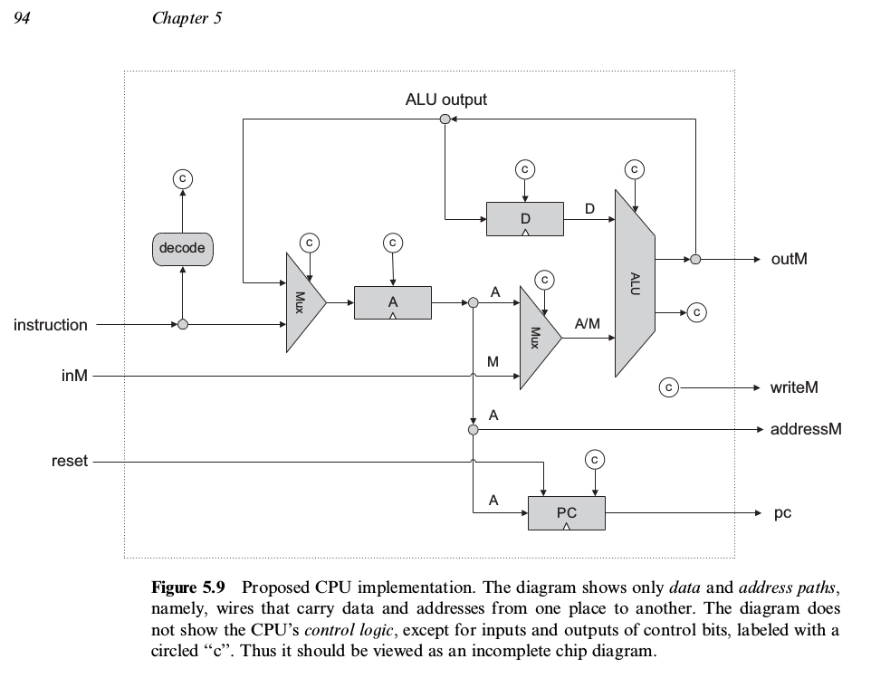
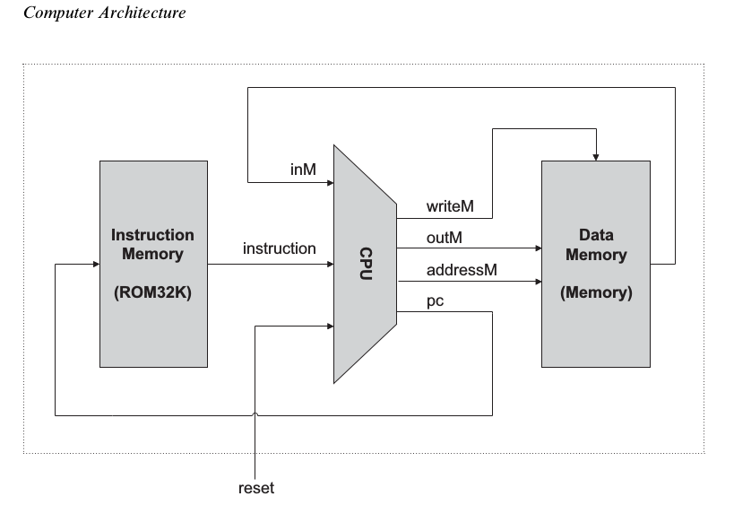
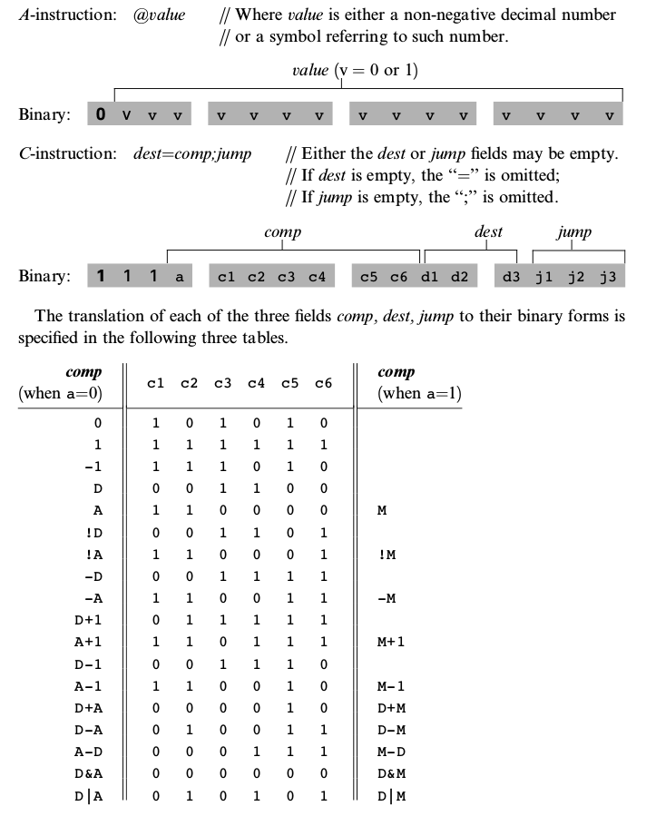
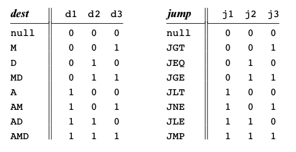
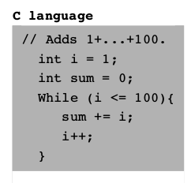
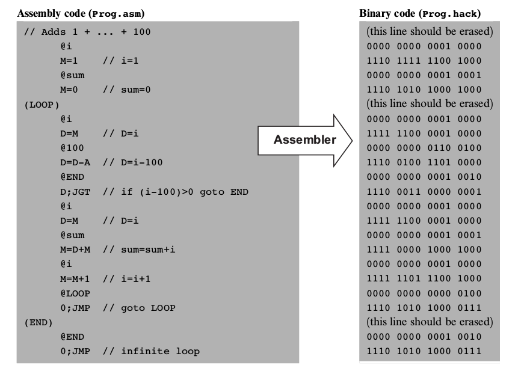

# The project

Virtual computer is a long project during wich I built a very simple yet functional computer and a programing language from the grownd up. This project is my implementation following the design of the computer described in the course Nand To Tetris, see their website for reference  <http://www.nand2tetris.org/>.

It consist of two part in the first one the hardware is implemented virtually. In the second part, an assembler, stack virtual machine, and compiler is implemented in order to create a programming language that can use the hardware built in the previous part. I will describe the 2 sections in detail.

## Hardware. 
Use an HDL Hadware Description Language to implement different chips, using only two elementary gates: Nand and flipflop. The Increased complexity increase gradualy to culminate in the implementation of a CPU, an a ROM and RAM memory units. 
Below a non exhaustive list of the chips implemented:
+ DMux8Way
+ Or16
+ Add16
+ ALU
+ Register
+ RAM16K
+ PC (program counter)
+ CPU
...

### Architecture
The computer consist of this CPU and these two memory units, the ROM is designed to accept a program, only one program can run at the time, like in an old nintendo cardtridge. The RAM is the main memory and directly map to a keyboard and a screen.

The registers are 16 bit longs. the CPU is very simple with only two register, one memory addressing register A and one data register D, a program counter PC and an arithmetic and logic unit chip ALU.

Below a description of the computer architecture.

### Instructions and Assembly
The instructions are 16 bits long.
Note that the only data type accepted is integer in two's complement, and only operations are addition and substraction. More functionalities are implemented by the standard library of the programming language in the second part.

There is two type of instructions:
+ A instruction insert a positive integer in the adressing register.
+ C instruction perform an operation on the two register and send the result to a destination. Or perform an operation on the two register and jump to a certain instruction in the ROM for branching.

The Assembly language associated with this hardware doesn't have a conventional syntax, but it is very easy to umderstand. Below the instruction sets and their assembly translation:

{: width=50% height=50% }

Below a piece of code in C translated in Assembly and then its machine instructions

  |  
:------------------------------------:|:-------------------------------------:
 

## Software. 
Java C# like programming language with a two tier compiler.
Implementation of a Standard Library/OS to provide functionalities.

## Example of Pong game.
You can test the program by compiling it with the Compiler.py script `python Compiler.py Pong`
It creates some file.vm of all classes. Continue with the VMtranslator then assembler.
The best way to test the program is to use the VMEmulator. This directory can then be loaded in the VMEmulator (to download from http://www.nand2tetris.org/software.php) to run the program.

## References
