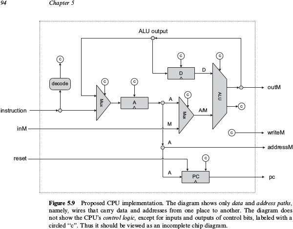

# The project

Virtual computer is a long project during wich I built a very simple yet functional computer and a programing language from the grownd up. This project is my implementation following the design of the computer described in the course Nand To Tetris, see their website for reference  <http://www.nand2tetris.org/>.
It consist of two part in the first one the hardware is implemented virtually. In the second part, an assembler, stack virtual machine, and compiler is implemented in order to create a programming language that can use the hardware built in the previous part. I will describe the 2 sections in detail.

## Hardware. 
Use an HDL Hadware Description Language to implement different chips, using only two elementary gates: Nand and flipflop. The Increased complexity increase gradualy to culminate in the implementation of a CPU, an a ROM and RAM memory units. The computer consist of this CPU and these two memory units, the ROM is design taccept a program, only one program can run at the time, like in an old nintendo cardtridge. The RAM is the main memory and is directly mapped to a keyboard and a screen.
Below the architecture of the cpu
Below the set of machine instructions available.
Note that the only data type accepted is integer and only operations are addition and substraction. More functionalities are implemented by the standard library of the programming language in the second part.

Below a description of the computer architecture.

## Software. 
Java C# like programming language with a two tier compiler.
Implementation of a Standard Library/OS to provide functionalities.

## Example of Pong game.
You can test a program by compiling it with the Compiler.py script, then translating the resulting file with the VMTranslator.py file, and finally producing machine instruction from the resulting file with the assembler.py script. The resulting file of all these operations is a text files comtaining the binary machine instruction in human readable language, it can be use directly by the Hardware Simulator (to download from http://www.nand2tetris.org/software.php) to run the program.
