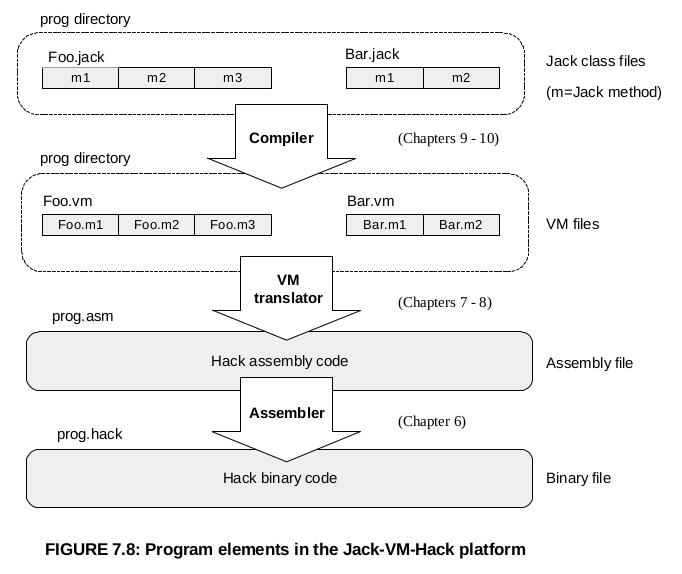

# The project

Virtual computer is a long project during wich I built a very simple yet functional computer and a programing language from the ground up. 
This project is my implementation following the design of the computer described in the course Nand To Tetris, see their website for reference  <http://www.nand2tetris.org/>.

It consist of two parts, in the first one the hardware is implemented virtually. 
In the second part, an assembler, a stack virtual machine, and a compiler are implemented in order to create a programming language that can use the hardware built in the previous part. 
I will describe the 2 sections in detail.

## Hardware. 
Use an HDL Hardware Description Language to implement different chips, using only two elementary gates: Nand and flipflop. 
The chip complexity increase gradualy to culminate in the implementation of a CPU, an a ROM and RAM memory units. 
Below a non exhaustive list of the chips implemented:
+ DMux8Way
+ Or16
+ Add16
+ ALU
+ Register
+ RAM16K
+ PC (program counter)
+ CPU
...

### Architecture
The computer consist of this CPU and these two memory units, the ROM is designed to accept a program. 
Only one program can run at the time, like in an old nintendo cardtridge. 
The RAM is the main memory, it maps directly to a keyboard and a screen.

The registers are 16 bit longs. 
The CPU is very simple with only two register, one memory addressing register A and one data register D, a program counter PC and an arithmetic and logic unit chip ALU.

Below a description of the computer architecture.

|      |
|-------------------------------------  |
|  |

### Instructions and Assembly
The instructions are 16 bits long.
Note that the only data type accepted is integer in two's complement, and only operations are addition and substraction. 
More functionalities are implemented by the standard library of the programming language in the second part.

There is two type of instructions:
+ A instruction: insert a positive integer in the adressing register.
+ C instruction: perform an operation on the two register and send the result to a destination. Or perform an operation on the two register and jump to a certain instruction in the ROM for branching.

The Assembly language associated with this hardware doesn't have a conventional syntax, but it is very easy to umderstand. 
Below the instruction sets and their assembly translation:

  |  
:-----------------------------:|:-------------------------------------:

Below a piece of code in C translated in Assembly and then in its machine instructions

  |  
:------------------------------------:|:-------------------------------------:
 

## Software.
This section describe all the steps leading to the implementation of a programming language called Jack.
This language is object oriented and similar to Java or C#, in much simpler of course.
It uses a two tier compiler: compilation to Virtual machine code (equivalent to byte code in Java), which can be read by the virtual machine itself to assembly code.

### Assembler
The assembler is a simple python program `assembler.py` That translate the assembly of our hardware platform describe earlier into machines instructions.

### Virtual Machine
The virtual machine translates VM code into assembly code.
The `VMTranslator.py` is implemented in python.
This is a stack base implementation using a stack for the function operations and some memory segments.
Indeed the big abstraction created by this VM is functions.

The memory segments are: 
+ local, local variables
+ argument, function arguments
+ static, static member of a class
+ stack, stack pointer
+ temp, temporary memory segment
+ that, used for array indexing
+ this, used for instance of object and menber access
+ pointer, switch for this or that pointer.

The VM code itself has just a few intructions, for stack operation:
+ push *memory-seg index*
+ pop *memory-seg index*
+ arithmetic operations: add, neg, sub, gt, lt...

For branching:
+ label *symbol*
+ goto *symbol*
+ if-goto *symbol*

For functions:
+ function *name local-var-number*
+ call *name arg-number*
+ return

### Compiler
The compiler translate Jack code into VM-code.
The compiler `JackCompiler.py` is imlemented in python. 
It adds functionalities for heap access, and therefore the important features brought in by the compiler are dynamic array and objects.
These functionalities are implemented by handling the THIS and THAT pointers presented earlier is the Virtual Machine, these two pointers address in the heap memory segment. 
The heap memory is managed in turn by the OS/Standard Library of the Jack language.
We will talk about the standart library later.
The compiler is composed of two parts, a syntax analyser (tokenizer, parser) and a code generator.
The code generator resolve symbols (variable, class and methods name) with a symbol table at two levels: class level and method level.

Below a description of the Jack language syntax:

### Jack Language and its standard library
The Jack language is simple and self explanatory. 
Some examples of code can be found is the Pong program example.
It is a Java-like Object Oriented language. 
Although it lacks operations for floating point number, inheritance and other important features.

I have implemented a Standard Library/OS to provide common functionalities to the language.
There is 9 classes in the standard library, all written in Jack:
+ Math : common mathematic operation.
+ String
+ Array 
+ Output : provide textual output on the screen.
+ Screen : provide graphical output on the screen.
+ Keyboard : provide keyboard input functionality
+ Memory : provide memory management on the heap.
+ Sys : provide system feature, like loading the standard library and starting the main method.

## Example of Pong game.
You can test the Pong program by compiling it with the Compiler.py script `python JackCompiler.py Pong`
It creates several file.vm, one for each class. 
Continue with the VMtranslator `python VMTranslator.py Pong`.
It creates a single assembly.asm code file.
Then run the assembler with the command `python assembler.py Pong.asm`, this output a text file containing the machine instructions in a textual form.
This resulting Pong.hack file can then be loaded into the ROM of the hardware-simulator and the program can be run.
The best way to test the program though is to use the VMEmulator. 
The Pong directory after Compilation with the `JackCompiler.py` can be loaded directly in the VMEmulator (to download from http://www.nand2tetris.org/software.php) to run the program.
You can now play a real Pong game on a craft computer!!

## References
This project follow the course created by professor Noam Nisan and Shimon Schocken. 
More information about this course can be found on the website <http://www.nand2tetris.org/>.
Or on the coursera platform <https://www.coursera.org/learn/build-a-computer> and <https://coursera.com/learn/nand2tetris2>

